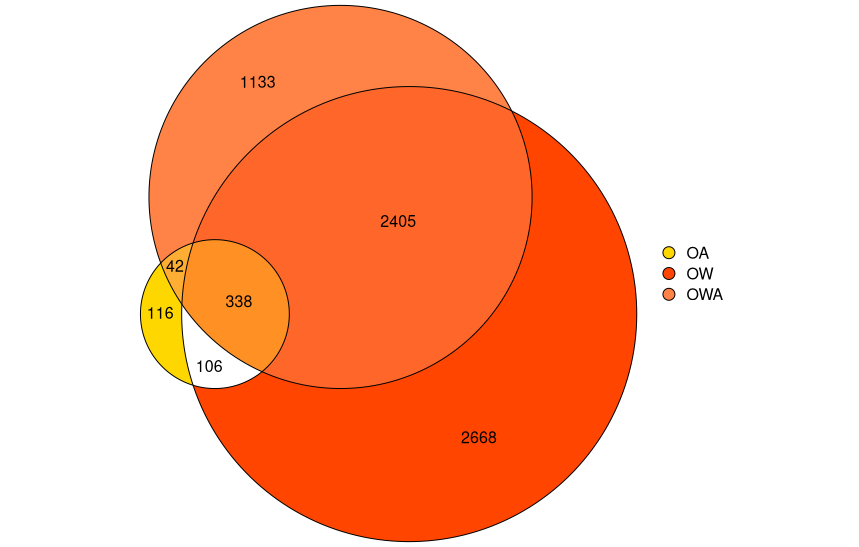
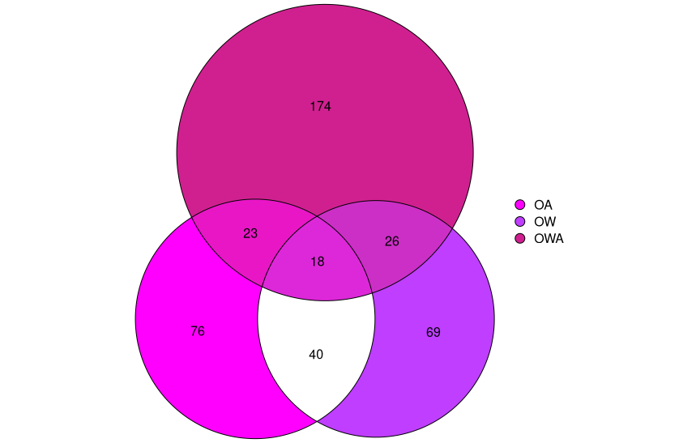

# Transcriptomics notebook

**Course:** Intro to Ecological Genomics - Fall 2026

**Name:** Meron Abraham

**Date:** 10/10/2026

------------------------------------------------------------------------

## Continuing HW1 script

-   Creating Euler plot for DEGs (F4 vs. F0) of each treatment group

### Working directory

`/gpfs1/home/m/a/mabraha3/projects/eco_genomics_2026/transcriptomics`

### Input files

`/gpfs1/home/m/a/mabraha3/projects/eco_genomics_2026/transcriptomics/Homework_1.r`

### Output files

`/gpfs1/home/m/a/mabraha3/projects/eco_genomics_2026/transcriptomics/transcriptomics_notebook_hw_10_10.md`

### Scripts

`/gpfs1/home/m/a/mabraha3/projects/eco_genomics_2026/transcriptomics/Homework_1.r`

### Code

```         
### Euler plot ###
# Comparing DEGs between generations of each treatment

# For OW vs AM
# make a list of significant differentially expressed genes for this contrast

# pull out the results for the contrast of interest
res_OWvsAM_F0 <- results(
  dds_F0, name="treatment_OW_vs_AM", 
  alpha=0.05
  )
res_OWvsAM_F0 <- res_OWvsAM_F0[order(res_OWvsAM_F0$padj),] # order them by significance
res_OWvsAM_F0 <- res_OWvsAM_F0[!is.na(res_OWvsAM_F0$padj),] # get rid of any NAs

# make a list of significant differentially expressed genes for this contrast
degs_OWvsAM_F0 <- row.names(res_OWvsAM_F0[res_OWvsAM_F0$padj < 0.05,]) 

#F4
res_OWvsAM_F4 <- results(dds_F4, name="treatment_OW_vs_AM", alpha=0.05)
res_OWvsAM_F4 <- res_OWvsAM_F4[order(res_OWvsAM_F4$padj),]
res_OWvsAM_F4 <- res_OWvsAM_F4[!is.na(res_OWvsAM_F4$padj),]
degs_OWvsAM_F4 <- row.names(res_OWvsAM_F4[res_OWvsAM_F4$padj < 0.05,])

### For OA vs AM
# F0
res_OAvsAM_F0 <- results(dds_F0, name="treatment_OA_vs_AM", alpha=0.05)
res_OAvsAM_F0 <- res_OAvsAM_F0[order(res_OAvsAM_F0$padj),]
res_OAvsAM_F0 <- res_OAvsAM_F0[!is.na(res_OAvsAM_F0$padj),]
degs_OAvsAM_F0 <- row.names(res_OAvsAM_F0[res_OAvsAM_F0$padj < 0.05,])
#F4
res_OAvsAM_F4 <- results(dds_F4, name="treatment_OA_vs_AM", alpha=0.05)
res_OAvsAM_F4 <- res_OAvsAM_F4[order(res_OAvsAM_F4$padj),]
res_OAvsAM_F4 <- res_OAvsAM_F4[!is.na(res_OAvsAM_F4$padj),]
degs_OAvsAM_F4 <- row.names(res_OAvsAM_F4[res_OAvsAM_F4$padj < 0.05,])

# For OWA vs AM
#F0
res_OWAvsAM_F0 <- results(dds_F0, name="treatment_OWA_vs_AM", alpha=0.05)
res_OWAvsAM_F0 <- res_OWAvsAM_F0[order(res_OWAvsAM_F0$padj),]
res_OWAvsAM_F0 <- res_OWAvsAM_F0[!is.na(res_OWAvsAM_F0$padj),]
degs_OWAvsAM_F0 <- row.names(res_OWAvsAM_F0[res_OWAvsAM_F0$padj < 0.05,])
#F4
res_OWAvsAM_F4 <- results(dds_F4, name="treatment_OWA_vs_AM", alpha=0.05)
res_OWAvsAM_F4 <- res_OWAvsAM_F4[order(res_OWAvsAM_F4$padj),]
res_OWAvsAM_F4 <- res_OWAvsAM_F4[!is.na(res_OWAvsAM_F4$padj),]
degs_OWAvsAM_F4 <- row.names(res_OWAvsAM_F4[res_OWAvsAM_F4$padj < 0.05,])

library(eulerr)

# Total
length(degs_OAvsAM_F0)  # 602
length(degs_OAvsAM_F4)  # 157
length(degs_OWvsAM_F0)  # 5517 
length(degs_OWvsAM_F4)  # 153
length(degs_OWAvsAM_F0)  # 3918
length(degs_OWAvsAM_F4)  # 241

# Intersections
length(intersect(degs_OAvsAM_F0,degs_OWvsAM_F0))  # 444
length(intersect(degs_OAvsAM_F4,degs_OWvsAM_F4))  # 58
length(intersect(degs_OAvsAM_F0,degs_OWAvsAM_F0))  # 380
length(intersect(degs_OAvsAM_F4,degs_OWAvsAM_F4))  # 41
length(intersect(degs_OWAvsAM_F0,degs_OWvsAM_F0))  # 2743
length(intersect(degs_OWAvsAM_F4,degs_OWvsAM_F4))  # 44

# Shared across all
intWA_F0 <- intersect(degs_OAvsAM_F0,degs_OWvsAM_F0)
length(intersect(degs_OWAvsAM_F0,intWA_F0)) # 338
intWA_F4 <- intersect(degs_OAvsAM_F4,degs_OWvsAM_F4)
length(intersect(degs_OWAvsAM_F4,intWA_F4)) # 18

# Number unique to each treatment
# OA F0
602-444-380+338 # 116 
# OW F0
5517-444-2743+338 # 2668
# OWA F0
3918-380-2743+338 # 1133 

# OA F4
157-58-41+18 # 76 
# OW F4
153-58-44+18 # 69
# OWA F4
241-41-44+18 # 174 

# Number shared in pairs of treatments
# OA & OW F0
444-338 # 106 
# OA & OWA F0
380-338 # 42 
# OWA & OW F0
2743-338 # 2405

# OA & OW F4
58-18 # 40
# OA & OWA F4
41-18 # 23
# OWA & OW F4
44-18 # 26

# Making the plot

fit1 <- euler(
  c(
    "OA" = 116, 
    "OW" = 2668, 
    "OWA" = 1133, 
    "OA&OW" = 106, 
    "OA&OWA" = 42, 
    "OW&OWA" = 2405, 
    "OA&OW&OWA" = 338
    )
  )

F0_euler <- plot(
  fit1,  
  quantities = TRUE,  
  fill = list(fill = c("gold","orangered", "sienna1", alpha = 0.5)),
  legend = list(labels = c("OA", "OW", "OWA"))
  )

fit2 <- euler(
  c(
    "OA" = 76, 
    "OW" = 69, 
    "OWA" = 174, 
    "OA&OW" = 40, 
    "OA&OWA" = 23, 
    "OW&OWA" = 26, 
    "OA&OW&OWA" = 18
  )
)

F4_euler <- plot(
  fit2,  
  quantities = TRUE,  
  fill = list(fill = c("magenta","darkorchid1", "violetred", alpha = 0.5)),
  legend = list(labels = c("OA", "OW", "OWA"))
)

F0_euler
F4_euler
```

### Programs/dependencies

`R version 4.5.1` `RStudio`

### Graphs/images

F0 DEGs



F4 DEGs



### Tables

| Col1 | Col2 | Col3 | Col4 | Col5 |
|------|------|------|------|------|
|      |      |      |      |      |
|      |      |      |      |      |
|      |      |      |      |      |

#### Notes/observations

-   Much fewer DEGs in F4 than F0

### Next steps

-   Volcano plot
